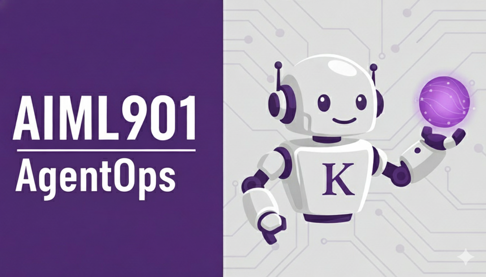

> [!tip] See what past students built!
> Explore the [Project Showcase](https://sebastienmartin.info/aiml901/showcase/) featuring projects from course alumni—complete with pitch videos, descriptions, and real-world AI applications across industries.

# AIML-901OP-5 AI Foundations for Managers - AgentOps

  
  

    <strong>Kellogg School of Management</strong> 
    Instructor: Sébastien Martin 
    <em>Email:</em> <a href="mailto:sebastien.martin@kellogg.northwestern.edu">sebastien.martin@kellogg.northwestern.edu</a> 
    <em>Website:</em> <a href="https://sebastienmartin.info">sebastienmartin.info</a>
  

# Course Overview

AI is advancing at an unprecedented pace. The best way to understand its potential is not just to study it, but to use it. This immersive course provides Kellogg students with extensive hands-on experience building with generative AI, equipping you with practical skills to immediately apply these technologies in business contexts. In just five weeks, you will go from AI outsider to AI insider, taking your first steps toward building solutions while developing the essential vocabulary and conceptual framework to navigate the rapidly evolving AI landscape. 
*Let's get building!*

## Course Features

- **State-of-the-Art:** While "AI" has many meanings, the focus of this course is on the *latest* AI developments. We will mostly study generative and agentic AI.
- **Lab format:** The best way to understand AI's strengths and limitations is to use it. The main deliverable is a project; weekly recitations are focused on building with AI, and most lectures include hands-on activities.
- **Leveraging AI Agents in n8n:** AI agents are the perfect vehicle to build expertise in AI. They are practical to build, sophisticated enough to reveal how AI really works, and relevant enough to spark discussions about operations, human collaboration, and organizational transformation. We will use _n8n_,  a leading AI agent and automation platform. n8n is accessible enough without coding background, yet powerful enough to allow for deep technical exploration.
- **Preparing You for the Future:** This course is designed to be a stepping stone in your AI journey, enabling you to stay current as AI continues to evolve.
- **AI-Powered Learning Support:** This course will heavily leverage AI to support learning. This will include AI homework, AI teaching assistants, and AI-powered case studies.

## Content

There are several versions of AIML-901, each taught by a different department. They all serve as a general introduction to AI for MBAs, and all touch on the following topics:

- AI and Machine Learning history.
- Machine Learning basics.
- Generative AI.
- Accountability, ethics, fairness, governance, and future considerations.
- AI applications in business and the manager's role.

However, each course is truly unique! This course focuses on agent AIML-901 and is taught in a lab format. Its focus is to be *as hands-on as possible*: we will actually build AI products and figure out how to create value with them. We will also *target the latest AI developments*, and therefore focus much more on generative AI than on traditional machine learning and analytics. The "operations" flavor comes from our focus on "agentic AI"—AI systems that actually perform work. AI agents are among the latest and most important developments in generative AI, and leveraging them is a deeply operational question.

With this version of the course, you will learn:

- **how to build agentic AI products** (the best way to know something is to be able to use it)
- **how the genAI technology actually works** (understanding a technology is key to leveraging it)
- **how to create AI products that actually add value** (it's not because a technology is amazing that it is useful)

*I highly recommend taking other versions of the AIML-901 course.* They all choose very different approaches to introducing AI, and I believe that the more perspectives you get, the better. For the most part, they are complementary rather than substitutes.
## Pre-requirements

This course is designed to be accessible to all Kellogg students without prerequisites (no need to know how to code!), regardless of technical background. If you have any doubts, please reach out. 

However, the course is also meant to _challenge you_! Our goal is to bring you up to speed on the latest AI developments, and achieving this in just 5 weeks will be a significant challenge. But I promise that it will be worth it!.

## Instructor

Professor Martin is an associate professor of operations, whose research focuses on designing and implementing AI/automation systems that solve real-world business challenges. He designed Lyft's reinforcement learning approach to matching drivers and passengers and also works on a similar project at Waymo. He is passionate about incorporating AI in education: he created Kai, Kellogg's teaching assistant, introduced the first AI-powered case studies, and was named a Poets & Quants ‘40 Under 40’ MBA professor in 2025. Outside research and teaching, he also consults with companies on AI strategy and serves as a board member of the industrial compounder ESAB, particularly focusing on their AI transition.

---

# Deliverables and Expectations

## Recitations: learning how to build an agent

The course includes five recitations, each lasting 60 minutes and led by our expert TA (in-person for Full Time, live on Zoom for E/W). The recitations will focus on learning how to build AI agents using n8n, which is the main technical knowledge you will need. The recitations will be hands-on and interactive, each one focused on a specific business use case and gradually introducing more complex agentic workflows.

Recitations will be divided into two sections. 
- **Core content**: We will begin by developing skills that you are expected to understand and be able to use independently. During this section, you will be given time to explore and expand upon these tools. 
- **Exploratory content**: The latter portion of the recitation will focus on broader, inspirational demos to showcase what is possible with n8n. You won't be expected to master the skills immediately; this is mostly to give you ideas on what to explore on your own. Additionally, we encourage you to explore n8n templates (pre-made projects by others), YouTube tutorials, and other resources.

Attendance at the recitations is not required but strongly recommended—live sessions (whether in-person or on Zoom) are interactive and let you ask questions in real-time. Recordings are also available after each recitation. 

Each recitation is associated with a graded homework. Together, they will count for 25% of the final grade.

## Individual Project

The main deliverable for this course is an individual project where you will build your own AI agent using n8n. This is the main deliverable of the course. The project's goal is two-fold: demonstrating your ability to make impressive AI agents and to do so in a way that actually creates value in a business context.

In a nutshell, the project is the evaluation mechanism of the course and will leverage everything we will learn. For a great project, you need to:
- Work on a topic you are *deeply familiar with*. As we will see, a great AI project is 5% AI knowledge, 95% domain knowledge. This is the only way to create a project that would genuinely add value. Ideally, the project's target should be either a previous company/organization you worked for, or a startup/product idea you have and want to work on.
- Have enough knowledge of AI to know the good ways to use it (i.e., you followed the lectures).
- Know how to build agents (i.e., you went through the recitations).

**Deliverable:**  
A recorded presentation video (8 minutes), together with a working MVP of your AI workflow using n8n. 

The video must include:
- An explanation of the business context and the problem you are trying to solve.
- A live demo of your AI agent in action, featuring n8n and any other tools of your choice.
- A demo of the "evaluation" of your agent: is it doing a good job?
- A discussion of the implementation path you suggest and why you think this change can truly add value.

**Grading:**  
- 40% idea/implementability/business value of your proposal  
- 40% technical implementation  
- 20% quality of the presentation

For more information, check out the [[project|project page]].

## Homework

Before class, a "Kai homework" will often be assigned. You will have a guided conversation with an AI teaching assistant (Kai) to prepare you for the next class, and you will submit your conversation on Canvas. 

- Homework is graded for **effort, not results**.  
- You will get full credit if you took it seriously and spent the time, regardless of accuracy. 

More information is available in [[kai_instructions|the Kai instructions]].

## Grading Rubric

The final grade will be based on:

- 50% Individual project
- 25% Recitations submissions
- 25% Participation (attendance, engagement, and homework effort)

## Attendance and Participation

Attendance, timeliness, and in-class contributions are extremely important to me, as everyone benefits from a positive learning environment.  

- In-class contributions consist mainly of voluntary participation.  
- Occasionally, I also use "warm calling," where I give you a heads up and ask you a question about something you already wrote in a class preparation homework.  
- On-time attendance is required.  
- Only health/religious/funeral-related absences are officially excused by Kellogg. If you are in this situation, _reach out to Academic Experience_, as they have a form for you to fill out.
- You have **one free pass** for other absences. Additional absences will reduce your participation grade proportionally.
- Per Kellogg policy, more than 20% unexcused absences may result in a failing grade.

## AI Policy

The use of AI in this course is encouraged and you will be given access to many AI tools. We will both learn about how to use AI and also use AI to help us learn.  

However, AI is a double-edged sword; while it may be tempting, try not to use it as a "black box" that does the work for you without seeking to understand how and why it produces its results.

## Classroom Etiquette and Honor Code

We follow the [Kellogg Honor Code](https://www.kellogg.northwestern.edu/the-experience/policies/honor-code/) and the [Code of Classroom Etiquette](https://www.kellogg.northwestern.edu/policies/etiquette.aspx).  

You may not:
1. Engage in cross-talking.  
2. Engage in disruptive movement (e.g., arriving late or leaving class unnecessarily).  
3. Use a smartphone, laptop, or other device outside of designated times.  
   - Tablets are allowed for note-taking, but only if used flat on the table.  
   - Laptops are required during designated hands-on times, but are not allowed otherwise.  
1. Engage in any other inappropriate or disruptive behavior.  

## Software, Tools and Costs

I've done my best to keep costs low. Expected costs/resources:

- ChatGPT/Claude/Gemini subscription recommended but not required. If you don't know what to choose, I recommend ChatGPT Plus.
- **n8n**: free (the course is sponsored by n8n).  
- **Lovable**: free (1 month sponsored access).  
- **Kai (AI TA)** and AI-powered case studies: free (covered by Kellogg).  
- **Required cost**: OpenAI API usage for your AI agents.
  - Expect total API costs of about **$5-10** for the entire course.

---

# Class Overview

There are 10 classes—two per week—organized into two modules. There is also one recitation per week. The precise content of each class is subject to modifications, as we are updating the content constantly to match the speed of AI improvement.

> [!note] E/W Section
> Classes are combined into five 3-hour sessions (Session 1 = Classes 1–2, Session 2 = Classes 3–4, etc.). Recitations are held live on Zoom.

- **Class 1: Let's Get Building**
  Dive straight into action using and creating AI agents while exploring course deliverables and expectations.

## Module 1: From Zero to the AI Frontier
*Build a deep understanding of genAI, how AI companies go from raw web data to ChatGPT and powerful AI agents, and how to control them.*

- **Class 2: Pretraining a Large Language Model**
  Train your own LLM from scratch to demystify how these powerful models actually learn from data.
- **Class 3: Post-training and Alignment**
  Discover the crucial steps that transform a raw LLM into a helpful, safe, and reliable AI assistant.
- **Class 4: Prompting LLMs**
  Now that the AI company has created a useful LLM, let's take control of it—this hands-on session explores prompting techniques across several use cases, a skill fundamental to everything in this class.
- **Class 5: AI Agents**
  How AI agents work (we finally understand n8n fully!), how to give them tools (RAG, etc.), and how to use them. We'll also have significant hands-on time with coding agents like Codex and Claude Code, which represent the frontier of agentic AI.
- **Class 6: The AI Frontier**
  An exploration of the state-of-the-art AI technologies and where all of this might be going.

## Module 2: Leveraging AI for Impact
*Bridge the gap between powerful AI tools and measurable business impact through agent ops, evaluation, strategy, and change management.*

- **Class 7: AgentOps**
  How do we go from "I can build a cool AI prototype" to "real world impact"?
- **Class 8: Evaluation and Continuous Improvement**
  How do we know if our AI workflow is working? How can we improve it?
- **Class 9: Change Management and Innovation**
  A deep dive into the Proxima Health case study—how do you drive impact with AI?
- **Class 10: Keeping up with AI**
  "Kai awards", advice to keep learning about AI, Farewell

## Recitations

- **Recitation 1: Let's Build a Google Calendar Agent (Getting Started with n8n)**  
  Master the fundamentals of n8n, your go-to platform for creating and testing intelligent agents.  
- **Recitation 2: Let’s Build an Email Triage Agent (n8n Deep Dive)**  
  Level up your n8n skills with advanced features that will empower your course project.  
- **Recitation 3: Let's Build a Bilingual Communications Agent (Advanced n8n Usage)**  
  Expand your project’s capabilities with advanced n8n functionalities to explore on your own.  
- **Recitation 4: Creating End-to-End Products with AI**
  Transform your agent backends into polished products using Lovable and other tools to create beautiful apps and websites.
- **Recitation 5: Let's Build an Expense Categorization Agent (Agent Evaluation)**  
  Build a robust evaluation pipeline in n8n, a critical requirement for your project's success.  

If you read this, thank you for being my student.